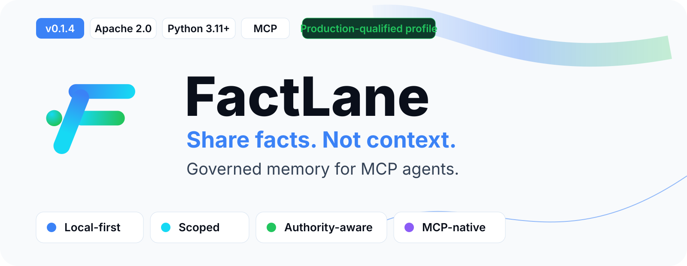
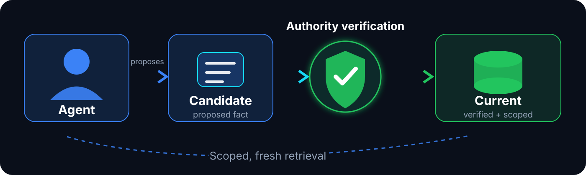

<h1 align="center">
<picture>
  <source media="(max-width: 600px) and (prefers-color-scheme: dark)" srcset="docs/assets/brand/readme/factlane-readme-hero-mobile-dark.svg">
  <source media="(max-width: 600px) and (prefers-color-scheme: light)" srcset="docs/assets/brand/readme/factlane-readme-hero-mobile-light.svg">
  <source media="(prefers-color-scheme: dark)" srcset="docs/assets/brand/readme/factlane-readme-hero-dark.svg">
  <source media="(prefers-color-scheme: light)" srcset="docs/assets/brand/readme/factlane-readme-hero-light.svg">
  
</picture>
</h1>

<div align="center">
<br>

[Quick Start](#quick-start) · [How it works](#how-factlane-works) · [Architecture](docs/ARCHITECTURE.md) · [Security](SECURITY.md) · [Release operations](docs/RELEASE_OPERATIONS.md)

</div>

---

## Memory that supports decisions without becoming authority

FactLane is a local-first memory service for agents that communicate over the Model Context Protocol (MCP). It stores **bounded facts** with provenance, scope, and freshness metadata so agents can reuse durable information without treating a past conversation, an unverified contribution, or the memory store itself as authority over the current task.

A user may explicitly ask to remember a bounded fact, or an agent may propose a reusable fact and
ask for explicit authorization. With the active launcher authority, approved content may be stored
as a **Candidate**. A separately trusted verifier decides whether it becomes **Current**. Current
retrieval admits only eligible, validated, fresh facts.

That distinction is the core of FactLane: **remembered context can support a decision without silently becoming current truth.**

- **Governed memory** — proposed facts do not become current truth automatically.
- **Exact scopes** — retrieval stays inside explicit scope and identity boundaries.
- **Local-first runtime** — durable storage and the supported embedding path stay local to the operator environment.
- **Focused MCP surface** — five public tools cover search, read, contribution, governed update, and status.

> [!IMPORTANT]
> FactLane memory is **supporting evidence**, not execution authority. Current user instructions, current repository or product state, and verified live sources outrank remembered facts.

## How FactLane works

<p align="center">
  <picture>
    <source media="(max-width: 600px)" srcset="docs/assets/brand/diagrams/factlane-memory-lifecycle-mobile.svg">
    
  </picture>
</p>

The key boundary is the transition from **Candidate** to **Current**:

- an ordinary `delegated-candidate` agent can contribute a Candidate only after explicit content
  consent; that consent does not grant or elevate launcher authority;
- it cannot self-promote by claiming privileged authority;
- trusted promotion uses `memory_update` with `REVERIFY`, revision checks, and the Candidate's expected record identity;
- `CURRENT` retrieval excludes unverified Candidates, even when they are a closer semantic match.

For semantic `CURRENT` search, FactLane applies validation eligibility before the KNN result limit, so closer unverified Candidates cannot crowd out eligible current facts.

## Quick Start

### Requirements

You need Python **3.11+**, a Python-linked SQLite runtime **3.42.0+**, [`uv`](https://docs.astral.sh/uv/), and a local [Ollama](https://ollama.com/) instance with the model for your selected embedding profile.

FactLane is CPU-capable. Docker, a GPU, and external embedding APIs are not required for the supported local profile.

### Install the exact `v0.1.3` release

Use the versioned release tag rather than the moving `main` branch:

```bash
git clone --branch v0.1.3 --depth 1 https://github.com/Habib1001-m/factlane.git
cd factlane
uv sync --frozen
uv run python -c 'import sqlite3; print(sqlite3.sqlite_version)'
ollama pull embeddinggemma:300m
uv run factlane --help
uv run factlane --help-tools
```

The SQLite check intentionally runs through the same project interpreter that launches FactLane. Python 3.11+ alone does **not** guarantee a compatible linked SQLite runtime.

For exact tag/tree verification, published wheel and source-distribution digests, upgrade planning, rollback boundaries, and post-install reverification, see [Release operations](docs/RELEASE_OPERATIONS.md).

### Launch for a local stdio MCP host

```bash
uv run factlane \
  --db ./factlane.sqlite3 \
  --profile embeddinggemma-300m-768 \
  --host-id local-dev
```

This first connection is intentionally **read-only**. Confirm the host can launch FactLane,
discover exactly five tools, and complete a read-only `memory_status` call before considering any
write profile. If Candidate contribution is later needed, `delegated-candidate` is a separate
trusted launcher change; it still does not let the agent validate its own facts. Trusted verifier
authority is configured separately by the operator.

> [!TIP]
> FactLane is a **stdio process launched by the MCP host**, not a web service or an interactive REPL. If your host starts it from another working directory, use absolute executable and database paths.

Full Codex and Hermes examples are in the [Quick Start guide](docs/QUICKSTART.md).

## Five focused MCP tools

FactLane keeps the public surface deliberately small:

| Tool | Purpose |
| --- | --- |
| `memory_search` | Search facts within one exact scope using current or historical retrieval. |
| `memory_get` | Retrieve one logical memory record and its provenance/revision details. |
| `memory_store` | Contribute one bounded fact with source and freshness metadata. |
| `memory_update` | Reverify a Candidate or replace a current revision under governed compare-and-swap rules. |
| `memory_status` | Inspect storage and embedding-profile health for a scope. |

The live MCP schema and `factlane --help-tools` are authoritative for request fields and supported values.

## Exact scopes, explicit identity

FactLane defines five public scopes:

| Scope | Identity model |
| --- | --- |
| `GLOBAL_USER` | No project/workflow identity. |
| `PROJECT` | Exact `project_id`. |
| `WORKFLOW` | Exact `project_id` + `workflow_id`. |
| `TOOL_ENVIRONMENT` | Exact `agent_id`. |
| `CROSS_PROJECT_WORKFLOW` | Identity-free; project, worktree, workflow, and agent identity keys must be absent. |

A trusted host may bind applicable project, workflow, or tool identities. Conflicting caller-supplied bound IDs are rejected. Records never fan out implicitly into other scopes.

`CROSS_PROJECT_WORKFLOW` does **not** mean “search every project.” It is a distinct identity-free scope with its own allowed intent/retrieval combinations.

## Built for explicit trust boundaries

The normal `delegated-candidate` write profile cannot promote its own contribution by supplying a privileged claim.

A trusted verifier can use `memory_update` to:

- **`REVERIFY`** a Candidate while preserving its logical contradiction identity; or
- **`REPLACE`** a current revision when the semantic identity itself changes.

Revision compare-and-swap, expected record identity, contradiction handling, and idempotency checks prevent stale or unauthorized transitions from becoming durable current state.

Governed failures return `status=BLOCKED` with a stable `error_code`, a safe message, empty results, and retry metadata. Unexpected internal exceptions remain transport errors rather than being relabeled as governed outcomes.

## Architecture

```text
Local MCP host / trusted launcher
        │
        ▼
Immutable host + write-context bindings
        │
        ▼
stdio MCP gateway — five public tools
        │
        ▼
Scope · identity · authority checks
        │
        ▼
Memory adapter · lifecycle · CAS · retrieval budgets
        │
        ├──────────────► Local embedding provider (Ollama)
        │
        └──────────────► SQLite / SQLite-vec storage
```

The gateway enforces host identity and scope policy. The adapter owns request validation, authority, freshness, contradiction handling, revision/transaction semantics, and retrieval budgets. The pinned backend supplies SQLite connection and vector-storage mechanics; it does not decide FactLane authorization.

Read the full [Architecture](docs/ARCHITECTURE.md) for the exact request path, storage contract, recovery coordination, and qualification boundary.

## Production-qualified profile

**FactLane `v0.1.3` is the first official production release.** It is production-qualified for the documented local deployment profile:

- Python **3.11+**;
- linked SQLite **3.42.0+**;
- command-launched **stdio MCP**;
- supported local Ollama embeddings;
- documented local POSIX storage/recovery contract.

Qualification covered package installation, backup/restore compatibility, bounded concurrent operation, crash/restart behavior, configured host startup, production-derived corpus retrieval, and fail-closed SQLite capacity handling.

This is deliberately a **bounded support statement**, not a universal deployment claim.

### Current limits

- stdio only — no HTTP, SSE, or Streamable HTTP server transport;
- local Ollama embeddings only — no remote embedding endpoint fallback;
- language and semantic-ranking quality remain workload-specific;
- arbitrary filesystem, client, language-mix, workload, or deployment-scale behavior is not implied;
- deterministic SQLite capacity exhaustion and permission-read-only behavior were exercised, but true kernel `ENOSPC` and true `EROFS` mount behavior remain outside the exercised evidence;
- a FactLane fact is bounded to **2,000 UTF-8 bytes**;
- FactLane is not a transcript archive, bulk file crawler, general document search engine, or backup service.

See [Environment and compatibility](docs/ENVIRONMENT.md) for the supported runtime and embedding profiles.

## Release integrity and version transitions

A release is more than a version string. FactLane records an official release by its versioned tag together with the corresponding commit/tree and published artifact digests.

`v0.1.3` is the first official production release, so there is **no earlier official production rollback target**.

Package/runtime rollback and durable-data rollback are separate compatibility questions. A package manager being able to replace one installed version with another does not prove that an older runtime can safely open a database modified by a newer release.

Use [Release operations](docs/RELEASE_OPERATIONS.md) for:

- exact `v0.1.3` tag, commit, and tree identity;
- wheel and source-distribution SHA-256 digests;
- source vs packaged installation paths;
- post-install reverification;
- future upgrade classification;
- package rollback vs database/schema rollback boundaries.

## Portable agent guidance

FactLane ships a portable [`using-factlane` Skill](skills/using-factlane/SKILL.md) alongside the Python runtime.

The Skill teaches agents when memory is useful, how to select an exact scope, how user-authorized
Candidate capture works, and how to respect Candidate/Current and authority boundaries. Its
host-neutral bootstrap reference distinguishes runtime installation, MCP configuration, Skill
presence, registration, discoverability, and loaded state. Installing the Python package does
**not** automatically register or activate the Skill in an MCP host.

## Security and sensitive-memory recovery

Sensitive-memory recovery is deliberately separate from normal MCP use. It is an operator-only procedure and is **not** a sixth public MCP tool.

Normal runtime engines and the recovery operator coordinate through maintenance and locking boundaries so a runtime cannot silently attach through a recovery promotion window. Recovery and deletion policy are documented in [Security](SECURITY.md) and [Architecture](docs/ARCHITECTURE.md).

## Documentation

| Guide | Use it for |
| --- | --- |
| [Quick Start](docs/QUICKSTART.md) | First installation, host configuration, and connection verification. |
| [Architecture](docs/ARCHITECTURE.md) | Request path, scopes, lifecycle, storage, recovery, and qualification boundaries. |
| [Environment](docs/ENVIRONMENT.md) | Runtime requirements, embedding profiles, and compatibility limits. |
| [Release operations](docs/RELEASE_OPERATIONS.md) | Exact release identity, install, upgrade, rollback, and reverification. |
| [Security](SECURITY.md) | Trust boundaries, write authority, incident recovery, and version-transition safety. |
| [Project history](docs/PROJECT_HISTORY.md) | How the current public contract and production profile evolved. |

## Develop

```bash
uv sync --frozen --dev
uv run pytest -q
```

The wheel and source distribution include the `using-factlane` Skill alongside the Python runtime.

## License

FactLane is licensed under [Apache-2.0](LICENSE). The pinned upstream backend and SQLite-vec retain their own licenses.
